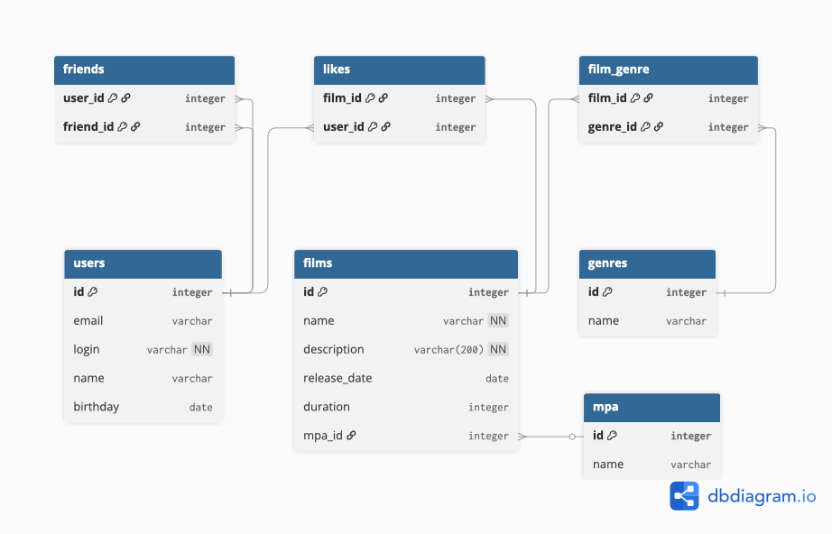

# Проект "Социальная сеть для оценки фильмов" 

Модель данных состоит из:  
таблиц: users, films,  
справочников: mpa, genres  
таблиц связей: friends, likes, film_genre.



Примеры запросов:  
-- Выбор всех фильмов
```
SELECT *
FROM films;
```

-- Выбор всех пользователей
```
SELECT *
FROM users;
```

-- Выбор наиболее популярных фильмов
```
SELECT f.ID, f.NAME, f.DESCRIPTION, f.RELEASE_DATE, f.DURATION, f.MPA_ID, COUNT(ls.USER_ID) AS count_likes
FROM films AS f
LEFT OUTER JOIN likes AS ls ON ls.FILM_ID = f.ID
GROUP BY f.ID , f.NAME, f.DESCRIPTION, f.RELEASE_DATE, f.DURATION, f.MPA_ID
ORDER BY COUNT(ls.USER_ID) DESC
LIMIT ?;
```